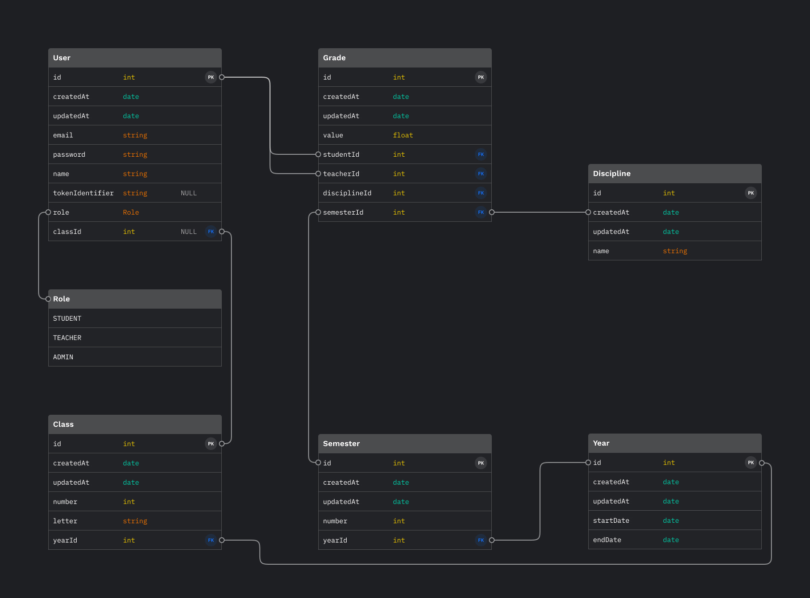

# School API

This is a REST API for a virtual scholar grades catalog.

## Overview

The project was built using the following technologies:

- [Express](https://expressjs.com/)
- [Prisma](https://www.prisma.io/)

## Requirements

- [NodeJS](https://nodejs.org)
- [Docker](https://www.docker.com/)
- [npm](https://www.npmjs.com)

## Database



The email and password of the default administrator account are **admin<span></span>@admin.com** and **admin**.

## Routes

All routes are found at `/api/v1/`.

The application uses JWT for authentication and authorization.

- `POST /auth/login` authenticates an user.
- `POST /auth/refresh` returns a new access token.

_To complete..._

## Running locally

```bash
git clone https://github.com/infamous55/school-api.git
cd school api && npm install
sudo docker-compose up
npm run start
```

Access at http://localhost:5000.
